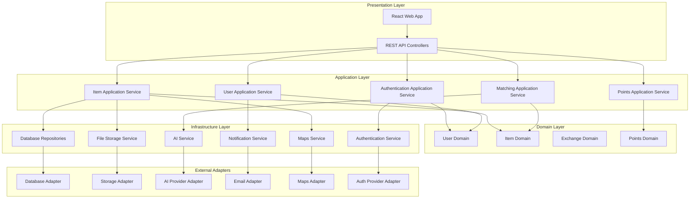

# Re:UseNet Design Document

## Overview

Re:UseNet is a community-based waste exchange web application that combines social networking, AI-powered matching, and gamification to facilitate local item reuse. The system follows a modular monolith architecture with clear separation of concerns, dependency injection, and pluggable service interfaces for easy technology stack swapping and deployment.

## Architecture

### Modular Monolith Architecture



### Technology Stack (Swappable Components)

- **Frontend**: React.js with TypeScript, Tailwind CSS
- **Backend**: Node.js with Express.js, TypeScript
- **Database**: PostgreSQL (swappable with MySQL, SQLite via adapter)
- **File Storage**: AWS S3 (swappable with Google Cloud Storage, local storage)
- **AI/ML**: OpenAI GPT-4 Vision (swappable with Google Vision, Azure Cognitive Services)
- **Maps**: Google Maps API (swappable with Mapbox, OpenStreetMap)
- **Authentication**: Auth0 (swappable with Okta, Firebase Auth, custom JWT)
- **Email**: SendGrid (swappable with AWS SES, Mailgun)
- **Deployment**: Docker containers with docker-compose for easy deployment

## Components and Interfaces

### Domain-Driven Design Structure

#### Domain Models (Core Business Logic)

##### User Domain
```typescript
class User {
  private constructor(
    private readonly id: UserId,
    private readonly email: Email,
    private profile: UserProfile,
    private location: Location,
    private ecoPoints: EcoPoints
  ) {}
  
  static create(userData: CreateUserData): User
  updateProfile(profile: UserProfile): void
  updateLocation(location: Location): void
  awardPoints(points: number, reason: string): void
  canExchangeWith(otherUser: User): boolean
}
```

##### Item Domain
```typescript
class Item {
  private constructor(
    private readonly id: ItemId,
    private readonly ownerId: UserId,
    private details: ItemDetails,
    private status: ItemStatus,
    private location: Location
  ) {}
  
  static create(itemData: CreateItemData): Item
  updateStatus(newStatus: ItemStatus): void
  isAvailableForExchange(): boolean
  calculateDistanceFrom(location: Location): Distance
}
```

##### Exchange Domain
```typescript
class Exchange {
  private constructor(
    private readonly id: ExchangeId,
    private readonly itemId: ItemId,
    private readonly giverId: UserId,
    private readonly receiverId: UserId,
    private status: ExchangeStatus
  ) {}
  
  static initiate(item: Item, giver: User, receiver: User): Exchange
  accept(): void
  complete(): void
  cancel(reason: string): void
  rate(rating: Rating, review?: string): void
}
```

#### Application Services (Use Cases)

##### Item Application Service
```typescript
interface IItemApplicationService {
  createItem(command: CreateItemCommand): Promise<ItemId>
  searchItems(query: SearchItemsQuery): Promise<ItemSearchResult[]>
  updateItemStatus(command: UpdateItemStatusCommand): Promise<void>
  getItemDetails(itemId: ItemId): Promise<ItemDetails>
}

class ItemApplicationService implements IItemApplicationService {
  constructor(
    private itemRepository: IItemRepository,
    private aiService: IAIService,
    private fileStorageService: IFileStorageService,
    private mapsService: IMapsService
  ) {}
}
```

##### User Application Service
```typescript
interface IUserApplicationService {
  registerUser(command: RegisterUserCommand): Promise<UserId>
  updateUserProfile(command: UpdateProfileCommand): Promise<void>
  getUserProfile(userId: UserId): Promise<UserProfile>
  verifyUser(command: VerifyUserCommand): Promise<void>
}
```

#### Infrastructure Services (Pluggable Adapters)

##### Repository Interfaces
```typescript
interface IItemRepository {
  save(item: Item): Promise<void>
  findById(id: ItemId): Promise<Item | null>
  findByLocation(location: Location, radius: number): Promise<Item[]>
  findByCategory(category: string): Promise<Item[]>
}

interface IUserRepository {
  save(user: User): Promise<void>
  findById(id: UserId): Promise<User | null>
  findByEmail(email: string): Promise<User | null>
}
```

##### Service Interfaces (Strategy Pattern)
```typescript
interface IFileStorageService {
  uploadFile(file: File, path: string): Promise<string>
  deleteFile(path: string): Promise<void>
  getFileUrl(path: string): Promise<string>
}

interface IAIService {
  analyzeImage(imageUrl: string): Promise<ImageAnalysisResult>
  categorizeItem(description: string, imageAnalysis: ImageAnalysisResult): Promise<string[]>
  findSimilarItems(item: Item): Promise<SimilarItemResult[]>
}

interface IAuthenticationService {
  authenticate(token: string): Promise<AuthResult>
  generateToken(user: User): Promise<string>
  refreshToken(refreshToken: string): Promise<string>
}

interface IMapsService {
  geocodeAddress(address: string): Promise<Coordinates>
  calculateDistance(from: Coordinates, to: Coordinates): Promise<number>
  findNearbyUsers(location: Coordinates, radius: number): Promise<UserId[]>
}

interface INotificationService {
  sendEmail(to: string, subject: string, body: string): Promise<void>
  sendPushNotification(userId: UserId, message: string): Promise<void>
}
```

### Adapter Implementations (Swappable)

#### Database Adapters
```typescript
// PostgreSQL Adapter
class PostgreSQLItemRepository implements IItemRepository {
  constructor(private db: Pool) {}
  // Implementation using pg library
}

// Firestore Adapter
class FirestoreItemRepository implements IItemRepository {
  constructor(private firestore: Firestore) {}
  // Implementation using Firebase SDK
}
```

#### Storage Adapters
```typescript
// AWS S3 Adapter
class S3FileStorageService implements IFileStorageService {
  constructor(private s3Client: S3Client) {}
  // Implementation using AWS SDK
}

// Google Cloud Storage Adapter
class GCSFileStorageService implements IFileStorageService {
  constructor(private storage: Storage) {}
  // Implementation using Google Cloud SDK
}
```

#### Authentication Adapters
```typescript
// Auth0 Adapter
class Auth0AuthenticationService implements IAuthenticationService {
  constructor(private auth0Client: Auth0Client) {}
  // Implementation using Auth0 SDK
}

// Okta Adapter
class OktaAuthenticationService implements IAuthenticationService {
  constructor(private oktaClient: OktaClient) {}
  // Implementation using Okta SDK
}
```

### Dependency Injection Container

```typescript
interface ServiceContainer {
  // Repositories
  itemRepository: IItemRepository
  userRepository: IUserRepository
  exchangeRepository: IExchangeRepository
  
  // Services
  fileStorageService: IFileStorageService
  aiService: IAIService
  authService: IAuthenticationService
  mapsService: IMapsService
  notificationService: INotificationService
  
  // Application Services
  itemAppService: IItemApplicationService
  userAppService: IUserApplicationService
  exchangeAppService: IExchangeApplicationService
}

class DIContainer implements ServiceContainer {
  constructor(private config: AppConfig) {
    this.initializeServices()
  }
  
  private initializeServices(): void {
    // Initialize based on configuration
    this.itemRepository = this.createItemRepository()
    this.fileStorageService = this.createFileStorageService()
    // ... other services
  }
  
  private createItemRepository(): IItemRepository {
    switch (this.config.database.type) {
      case 'postgresql':
        return new PostgreSQLItemRepository(this.config.database.connection)
      case 'firestore':
        return new FirestoreItemRepository(this.config.database.connection)
      default:
        throw new Error(`Unsupported database type: ${this.config.database.type}`)
    }
  }
}
```

### REST API Controllers

```typescript
class ItemController {
  constructor(private itemAppService: IItemApplicationService) {}
  
  @Post('/api/items')
  async createItem(@Body() request: CreateItemRequest): Promise<CreateItemResponse> {
    const command = new CreateItemCommand(request)
    const itemId = await this.itemAppService.createItem(command)
    return { itemId: itemId.value }
  }
  
  @Get('/api/items')
  async searchItems(@Query() query: SearchItemsRequest): Promise<SearchItemsResponse> {
    const searchQuery = new SearchItemsQuery(query)
    const results = await this.itemAppService.searchItems(searchQuery)
    return { items: results }
  }
}
```

## Data Models

### Core Entities

#### User Model
```typescript
interface User {
  id: string;
  email: string;
  phone: string;
  displayName: string;
  avatar?: string;
  location: {
    latitude: number;
    longitude: number;
    address: string;
  };
  isVerified: boolean;
  accountType: 'individual' | 'organization';
  ecoPoints: number;
  rating: number;
  totalExchanges: number;
  createdAt: Date;
  updatedAt: Date;
}
```

#### Item Model
```typescript
interface Item {
  id: string;
  userId: string;
  title: string;
  description: string;
  category: string;
  tags: string[];
  images: string[];
  condition: 'new' | 'like-new' | 'good' | 'fair' | 'poor';
  status: 'available' | 'pending' | 'exchanged' | 'removed';
  location: {
    latitude: number;
    longitude: number;
    address: string;
  };
  dimensions?: {
    length: number;
    width: number;
    height: number;
    weight: number;
  };
  pickupInstructions?: string;
  createdAt: Date;
  updatedAt: Date;
}
```

#### Exchange Model
```typescript
interface Exchange {
  id: string;
  itemId: string;
  giverId: string;
  receiverId: string;
  status: 'requested' | 'accepted' | 'completed' | 'cancelled';
  scheduledPickup?: Date;
  completedAt?: Date;
  giverRating?: number;
  receiverRating?: number;
  giverReview?: string;
  receiverReview?: string;
  ecoPointsAwarded: number;
  createdAt: Date;
  updatedAt: Date;
}
```

### Database Schema Design

#### Indexing Strategy
- **Geographic Indexes**: PostGIS extension for efficient location-based queries
- **Search Indexes**: Full-text search on item titles and descriptions
- **Category Indexes**: B-tree indexes on category and tag fields
- **User Indexes**: Composite indexes on user location and activity metrics

#### Relationships
- Users have many Items (one-to-many)
- Items have many Exchanges (one-to-many)
- Users participate in Exchanges as giver or receiver (many-to-many through Exchange)
- Users can rate each other through completed Exchanges

## Error Handling

### Error Categories

#### 1. Validation Errors (400)
- Invalid item data (missing required fields, invalid formats)
- Geographic coordinate validation
- Image file type and size validation
- User input sanitization failures

#### 2. Authentication Errors (401/403)
- Invalid or expired JWT tokens
- Unverified user attempting restricted actions
- Insufficient permissions for organization features

#### 3. Business Logic Errors (422)
- Attempting to exchange unavailable items
- Self-exchange prevention
- Duplicate interest expressions
- Invalid status transitions

#### 4. External Service Errors (502/503)
- AI service unavailability
- Maps API failures
- File upload service errors
- Email/SMS delivery failures

### Error Response Format
```typescript
interface ErrorResponse {
  error: {
    code: string;
    message: string;
    details?: any;
    timestamp: string;
    requestId: string;
  };
}
```

### Resilience Patterns
- **Circuit Breaker**: For AI and external service calls
- **Retry Logic**: Exponential backoff for transient failures
- **Graceful Degradation**: Core functionality continues when AI services are down
- **Fallback Mechanisms**: Manual categorization when AI fails

## Testing Strategy

### Testing Pyramid

#### Unit Tests (70%)
- **Model Validation**: Test data model constraints and business rules
- **Service Logic**: Test core business logic in isolation
- **Utility Functions**: Test helper functions and algorithms
- **AI Integration**: Mock AI services and test integration logic

#### Integration Tests (20%)
- **API Endpoints**: Test complete request/response cycles
- **Database Operations**: Test data persistence and retrieval
- **External Service Integration**: Test with real external APIs in staging
- **Authentication Flow**: Test complete auth workflows

#### End-to-End Tests (10%)
- **User Journeys**: Test complete user workflows from registration to exchange
- **Cross-Platform**: Test web and mobile app functionality
- **Performance**: Load testing for concurrent users and large datasets
- **Geographic Features**: Test location-based matching and search

### Test Data Strategy
- **Synthetic Data**: Generate realistic test items and user profiles
- **Geographic Test Data**: Use real coordinates for major cities
- **AI Test Scenarios**: Prepare diverse item images and descriptions
- **Edge Cases**: Test boundary conditions for distances, point calculations

### Continuous Testing
- **Automated Testing**: Run full test suite on every commit
- **Staging Environment**: Mirror production with realistic data volumes
- **A/B Testing Framework**: Test matching algorithm improvements
- **Monitoring**: Real-time error tracking and performance metrics

## Deployment Strategy

### Docker-Based Deployment

#### Multi-Stage Dockerfile
```dockerfile
# Build stage
FROM node:18-alpine AS builder
WORKDIR /app
COPY package*.json ./
RUN npm ci --only=production

# Production stage
FROM node:18-alpine AS production
WORKDIR /app
COPY --from=builder /app/node_modules ./node_modules
COPY . .
EXPOSE 3000
CMD ["npm", "start"]
```

#### Docker Compose Configuration
```yaml
version: '3.8'
services:
  app:
    build: .
    ports:
      - "3000:3000"
    environment:
      - NODE_ENV=production
      - DATABASE_URL=${DATABASE_URL}
      - STORAGE_PROVIDER=${STORAGE_PROVIDER}
      - AUTH_PROVIDER=${AUTH_PROVIDER}
    depends_on:
      - database
      - redis
  
  database:
    image: postgres:15-alpine
    environment:
      - POSTGRES_DB=reusenet
      - POSTGRES_USER=${DB_USER}
      - POSTGRES_PASSWORD=${DB_PASSWORD}
    volumes:
      - postgres_data:/var/lib/postgresql/data
  
  redis:
    image: redis:7-alpine
    volumes:
      - redis_data:/data

volumes:
  postgres_data:
  redis_data:
```

### Configuration Management

#### Environment-Based Configuration
```typescript
interface AppConfig {
  database: {
    type: 'postgresql' | 'mysql' | 'firestore'
    connection: string
  }
  storage: {
    provider: 'aws-s3' | 'gcs' | 'local'
    config: Record<string, any>
  }
  auth: {
    provider: 'auth0' | 'okta' | 'firebase' | 'custom'
    config: Record<string, any>
  }
  ai: {
    provider: 'openai' | 'google' | 'azure'
    config: Record<string, any>
  }
  maps: {
    provider: 'google' | 'mapbox' | 'osm'
    config: Record<string, any>
  }
}

class ConfigLoader {
  static load(): AppConfig {
    return {
      database: {
        type: process.env.DATABASE_TYPE as any || 'postgresql',
        connection: process.env.DATABASE_URL || 'postgresql://localhost:5432/reusenet'
      },
      storage: {
        provider: process.env.STORAGE_PROVIDER as any || 'local',
        config: this.loadStorageConfig()
      },
      // ... other configurations
    }
  }
}
```

### Easy Technology Swapping

#### Factory Pattern for Service Creation
```typescript
class ServiceFactory {
  static createFileStorageService(config: StorageConfig): IFileStorageService {
    switch (config.provider) {
      case 'aws-s3':
        return new S3FileStorageService(config.config)
      case 'gcs':
        return new GCSFileStorageService(config.config)
      case 'local':
        return new LocalFileStorageService(config.config)
      default:
        throw new Error(`Unsupported storage provider: ${config.provider}`)
    }
  }
  
  static createAuthService(config: AuthConfig): IAuthenticationService {
    switch (config.provider) {
      case 'auth0':
        return new Auth0AuthenticationService(config.config)
      case 'okta':
        return new OktaAuthenticationService(config.config)
      case 'firebase':
        return new FirebaseAuthService(config.config)
      default:
        throw new Error(`Unsupported auth provider: ${config.provider}`)
    }
  }
}
```

#### Migration Scripts
```typescript
class DatabaseMigrator {
  constructor(private sourceRepo: IItemRepository, private targetRepo: IItemRepository) {}
  
  async migrate(): Promise<void> {
    // Generic migration logic that works with any repository implementation
    const items = await this.sourceRepo.findAll()
    for (const item of items) {
      await this.targetRepo.save(item)
    }
  }
}
```